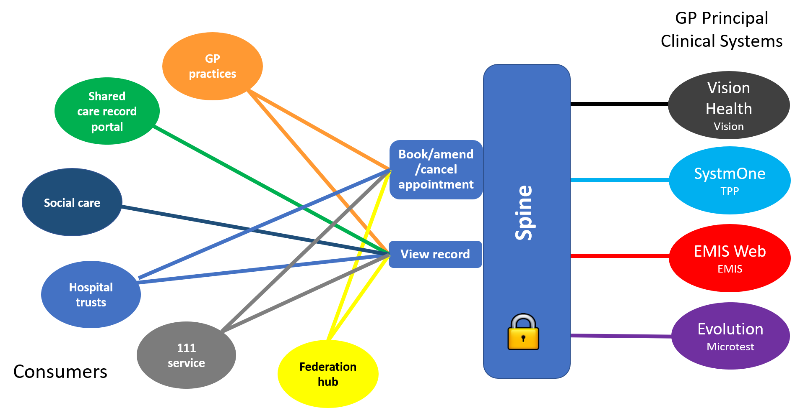


{:target="_blank" class="no_icon"} {:target="_blank" class="no_icon"} 


GP Connect is a national interoperabilty programme that's opening up information and data held within the different GP clinical systems for use across the whole of health and social care - ensuring patient medical information is available to the right clinician, at the right time, wherever they are. 

We're developing a set of application programming interfaces (APIs) that will seamlessly connect the four main provider systems (EMIS Web, INPS Vision, Microtest Open Evolution and TPP SystmOne) and allow them to exchange data with ease.

The development of applications that consume the data (allowing people to use or view information) will be the responsibility of local NHS organisations, which means they choose the system that best meets their needs and those of their patients (while, of course, ensuring that appropriate safety and governance measures are in place).

## GP Connect data model ##

## Benefits of GP Connect ##

-   **Clinical:** real-time access to patients' records to allow clinicians access to the right information, at the right time to help make the right decisions

-   **Patient/carer:** increased access opportunities (such as ability to access an appointment anywhere within a federation/hub) -   plus improved patient experience and satisfaction

-   **Administrative:** ability to book or cancel appointments and send tasks or notifications within a local geography across federations/hubs
 
-   **Management:** ability to understand appointment capacity across federated practices, providing single points of access for patients to book -  meaning more efficient access to services, better resource planning, and improved reporting data

-   **Technical:** first nationally-defined, standards-based step on the interoperability journey for GP systems

## Capabilities ##

The GP Connect APIs are managed within 'capabilities' that focus on a particular area of general practice interoperability. Capabilities are organised within 'capability packs', which include:

 -   **Foundations:** covers the basic API requirements and prerequisites needed to use the GP Connect APIs
 -   **Appointment Management:** enables end users to book and manage GP practice appointments held in any of the four GP principal practice systems
 -   **Access Record HTML:** provides health professionals with access to a patient’s primary care record by requesting sections or headings
 -   **Access Record Structured:** enables a system to consume a patient’s GP record in a machine-readable format, removing the need to transcribe information from one system to another
 -   **Task Management:** allows care professionals to send task requests to other teams  
 -   **Unstructured Writeback:** 

## Business drivers ##

Supporting improved access to general practice by:

- providing access to the detailed care record to every practice at the point of care
- allowing appointment management (booking and cancelling) between practices in a federation or hub or other affiliation
- allowing tasks to be sent between practices in a federation
- enabling clinicans at other care settings (such as hospitals, 111 and urgent care providers) to access information to suit their local needs

## Strategic drivers ##

- [Government Paperless 2020 (Personalised Health and Care Framework)](https://www.gov.uk/government/publications/personalised-health-and-care-2020)
  - ‘all patient and care records will be digital, interoperable and real-time by 2020’

- [NHS England General Practice Five Year Forward View](https://www.england.nhs.uk/gp/gpfv/)
  - Greater collaboration and sharing of information through IT system interoperability across the health and care system

## Development pathways ##

This GitHub repository contains all the technical resources you need to connect between clinical systems and GP data using our FHIR&reg; APIs.
 
To continue on your development journey, follow the relevant pathway:

         

                                                           

                        

             

                 

                     
                           <i class="fa fa-circle fa-stack-2x text-primary" style="color:#005EB8"></i>
                           <i class="fa fa-desktop fa-stack-1x fa-inverse"></i>
                     
                 

                 

                      <h4>Consumer supplier</h4>
                         
You're a software development company already working with the NHS or would like to work with the NHS. You have checked that you comply with IG requirements.

                         
You want to use GP Connect to develop a service (API) to consume GP data.  You intend to work with a suitable end-user organisation, which you may or not have already identified.

                     <a href="overview_consumer_pathway.html" class="btn btn-primary">Learn more</a>
                 

             

         

            

             

                 

                     
                           <i class="fa fa-circle fa-stack-2x text-primary" style="color:#005EB8"></i>
                           <i class="fa fa-globe fa-stack-1x fa-inverse"></i>
                     
                 

                 

                     <h4>Clinical system provider</h4>
                         
You're a GP clinical data provider.

                     
You want to use GP Connect to develop a way of allowing other systems to access GP data on your system for direct patient care.

                     <a href="overview_provider_pathway.html" class="btn btn-primary">Learn more</a>
                 

             

         

           

             

                 

                     
                           <i class="fa fa-circle fa-stack-2x text-primary" style="color:#005EB8"></i>
                           <i class="fa fa-user-md fa-stack-1x fa-inverse"></i>
                     
                 

                 

                     <h4>End-user organisation</h4>
                     
You're a CCG with GP practices organised in a federation, club or hub; you're a hospital or provider of emergency care.

                              
You want to use an existing GP Connect service (API) - or commission someone to create a new one - to access GP data from more than one GP clinical data provider to improve direct patient care.

                     <a href="overview_end_user_pathway.html" class="btn btn-primary">Learn more</a>
                                     

         

         
 

     








